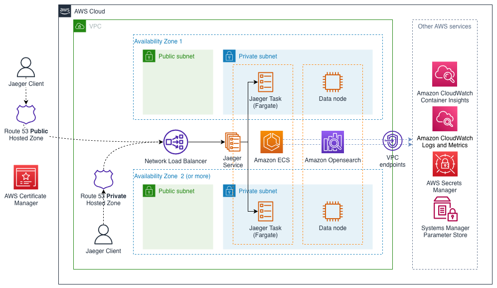

# Modular and Scalable Jaeger Architecture on AWS

This Quick Start helps you to deploy a Highly Available Jaeger - open source, end-to-end distributed tracing backend on the Amazon Web Services (AWS) Cloud.

You can use the AWS CloudFormation templates included with the Quick Start to deploy Jaeger
in your AWS account in about 10-30 minutes. The Quick Start automates the following:

- Deploying Jaeger into a new VPC
- Deploying Jaeger into an existing VPC

You can also use the AWS CloudFormation templates as a starting point for your own implementation.



This Quick Start integrates Jaeger with the following AWS services:

* [AWS CloudFormation](https://aws.amazon.com/cloudformation/) infrastructure as code Jaeger deployment
* [Amazon ECS](https://aws.amazon.com/ecs/) HA Fargate cluster
* [Amazon Opensearch](https://aws.amazon.com/opensearch-service/) HA cache cluster
* [Amazon CloudWatch](https://aws.amazon.com/cloudwatch/) integration for logs and metrics
* [Amazon Route53](https://aws.amazon.com/route53/) hosted zone for DNS configuration
* [AWS Certificate Manager](https://aws.amazon.com/certificate-manager/) integration for TLS certificates

For architectural details, best practices, step-by-step instructions, and customization options, see the [deployment guide](https://kolomiets.github.io/quickstart-jaeger).

To post feedback, submit feature ideas, or report bugs, use the **Issues** section of this GitHub repo. 
If you'd like to submit code for this Quick Start, please review the [AWS Quick Start Contributor's Kit](https://aws-quickstart.github.io/).

## Local build 

General build sequence
1. Clone the repository and restore submodules:

   ```sh
   # clone with submodules
   git clone --recurse-submodules https://github.com/kolomiets/quickstart-jaeger.git
   
   # if repository is clonned already
   git submodule update --init --recursive
   ```
2. Build [taskcat](https://github.com/aws-quickstart/taskcat) docker image with the following command:

    ```docker build -t jaeger-taskcat .```
3. In the folder with .tackcat.yml file:
   
    ```docker run -it -v $(pwd):/src -v ${HOME}/.aws/credentials:/root/.aws/credentials:ro -v /var/run/docker.sock:/var/run/docker.sock jaeger-taskcat test run```
 
Some comments about docker run parameters:

- ```-v $(pwd):/src``` – shares quickstart files with taskcat container
- ```-v ~/.aws:/root/.aws:ro``` – pass AWS credentials to container, see below
- ```-v /var/run/docker.sock:/var/run/docker.sock``` – to be able to build docker images used host Docker

  > **NOTE**: 
  > In CI/CD environment you may want to use tools like [dind](https://hub.docker.com/_/docker) or [kaniko](https://github.com/GoogleContainerTools/kaniko)
  > to build the images. 

### Sharing AWS credentials with taskcat container
You have multiple options to share AWS credentials with the container:

1. Pass AWS_ACCESS_KEY_ID, AWS_SECRET_ACCESS_KEY, AWS_DEFAULT_REGION as environment variables:

    ```docker run -e  AWS_ACCESS_KEY_ID=<access-key-id> -e AWS_SECRET_ACCESS_KEY=<secret-access-key> -e AWS_DEFAULT_REGION=<region> [rest of the parameters]```

1. Mount your ```.aws``` folder and use profile name when you run taskcat:

    ```docker run -v ${HOME}/.aws/credentials:/root/.aws/credentials:ro [rest of the parameters] jaeger-taskcat –profile <my-profile> test run```
 
### Getting taskcat help output
Run docker image without parameters to get the help output. Some examples:

```
docker run jaeger-taskcat
docker run jaeger-taskcat test -h
docker run jaeger-taskcat test run -h
```
