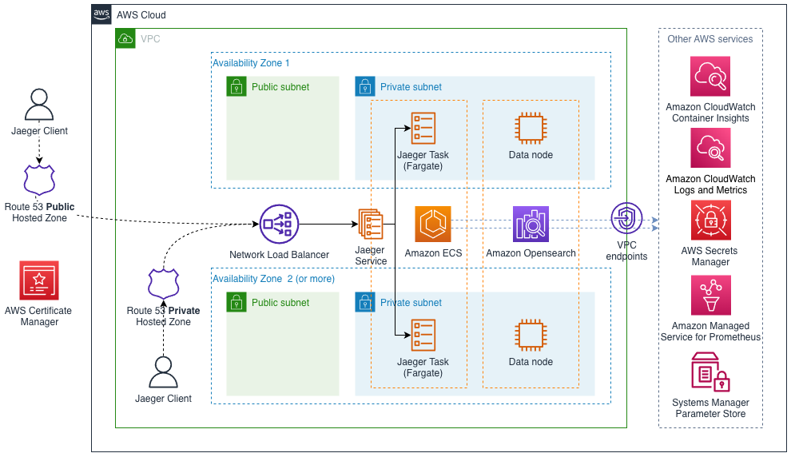

# Disclaimer

This is **NOT** an official [AWS Quick Start](https://aws.amazon.com/quickstart/).
The project is built according to [AWS Quick Start Contributor's Guide](https://aws-quickstart.github.io/)
but it is not approved by AWS and Jaeger teams.

# Modular and Scalable Jaeger Architecture on AWS


## Table of contents

   * [Overview](#overview)
   * [Documentation](#documentation)
   * [Contribution](#contribution)
   * [Deployment](#deployment)
   * [Running tests](#running-tests)

## Overview

This Quick Start helps you to deploy a Highly Available Jaeger - open source, end-to-end distributed tracing backend on the Amazon Web Services (AWS) Cloud.

You can use the AWS CloudFormation templates included with the Quick Start to deploy Jaeger
in your AWS account in about 10-30 minutes. The Quick Start automates the following:

- Deploying Jaeger into a new VPC
- Deploying Jaeger into an existing VPC

You can also use the AWS CloudFormation templates as a starting point for your own implementation.



This Quick Start integrates Jaeger with the following AWS services:

* [AWS CloudFormation](https://aws.amazon.com/cloudformation/) infrastructure as code Jaeger deployment
* [Amazon ECS](https://aws.amazon.com/ecs/) highly available Fargate cluster
* [Amazon Opensearch](https://aws.amazon.com/opensearch-service/) highly available search cluster
* [Amazon CloudWatch](https://aws.amazon.com/cloudwatch/) integration for logs and metrics
* [Amazon Route53](https://aws.amazon.com/route53/) hosted zone for DNS configuration
* [AWS Certificate Manager](https://aws.amazon.com/certificate-manager/) integration for TLS certificates

## Documentation

For architectural details, best practices, step-by-step instructions, and customization options, see the [deployment guide](https://kolomiets.github.io/quickstart-jaeger).

## Contribution
To post feedback, submit feature ideas, or report bugs, use the **Issues** section of this GitHub repo. 
If you'd like to submit code for this Quick Start, please review the [AWS Quick Start Contributor's Kit](https://aws-quickstart.github.io/).

## Deployment
Jaeger Quick Start CloudFormation templates can be deployed in your AWS environment using
the procedure outlined below:

 - Download Jaeger Quick Start CloudFormation templates from [Releases page](https://github.com/kolomiets/quickstart-jaeger/releases)
 - Upload the templates *preserving folder structure* to S3 bucket in your AWS account
   
 - Get object URL for either `jaeger-entry-new-vpc.template.yaml` or `jaeger-entry-existing-vpc.template.yaml` entry template from `templates` folder
   
 - Go to [AWS CloudFormation console](https://console.aws.amazon.com/cloudformation/) - select the region you want to deploy the Quick Start to and click **Create Stack** -> **With new resources**
 - Use object URL for the entry template as **Amazon S3 URL**, click **Next**
   
 - On the **Specify stack details** page, change the stack name if needed. Review the parameters for the template, and provide values for any parameters that require input. For all other parameters, review the default settings, and customize them as necessary. Make sure that **AWS Quick Start configuration** parameters correctly reflect information about your S3 bucket. Click **Next** when ready
   
 - On the **Configure stack options** page, you can [specify tags](https://docs.aws.amazon.com/AWSCloudFormation/latest/UserGuide/aws-properties-resource-tags.html) for resources in your stack and [set advanced options](https://docs.aws.amazon.com/AWSCloudFormation/latest/UserGuide/cfn-console-add-tags.html). When you’re done, choose **Next**.
 - On the **Review** page, review and confirm the template settings. Under **Capabilities**, select the two check boxes to acknowledge that the template creates IAM resources and might require the ability to automatically expand macros.

 - Choose **Create stack** to deploy the stack.
 - Wait until the stack is in `CREATE_COMPLETE` state
 - Click on the stack and navigate to the **Outputs** tab. Click **JaegerURL** output values to open Jaeger web interface.
   
## Running tests

AWS Quick Starts rely on [TaskCat](https://github.com/aws-ia/taskcat) to validate the CloudFormation templates
and test the deployments with different parameters across multiple regions. Once Quick Start is approved by AWS team,
passed TaskCat tests are mandatory for PR merge. 

You can run the tests in your own AWS environment using the following steps:

1. Clone the repository and restore submodules:

   ```sh
   # clone with submodules
   git clone --recurse-submodules https://github.com/kolomiets/quickstart-jaeger.git
   
   # if repository is clonned already
   git submodule update --init --recursive
   ```
2. Build [TaskCat](https://github.com/aws-quickstart/taskcat) docker image with the following command:

    ```docker build -t jaeger-taskcat .```
3. In the folder with .tackcat.yml file:
   
    ```docker run -it -v $(pwd):/src -v ${HOME}/.aws/credentials:/root/.aws/credentials:ro -v /var/run/docker.sock:/var/run/docker.sock jaeger-taskcat test run```
 
Some comments about docker run parameters:

- ```-v $(pwd):/src``` – shares quickstart files with TaskCat container
- ```-v ~/.aws:/root/.aws:ro``` – pass AWS credentials to container, see below
- ```-v /var/run/docker.sock:/var/run/docker.sock``` – to be able to build docker images used host Docker

  > **NOTE**: 
  > In CI/CD environment you may want to use tools like [dind](https://hub.docker.com/_/docker) or [kaniko](https://github.com/GoogleContainerTools/kaniko)
  > to build the images. 

### Sharing AWS credentials with TaskCat container
You have multiple options to share AWS credentials with the container:

1. Pass AWS_ACCESS_KEY_ID, AWS_SECRET_ACCESS_KEY, AWS_DEFAULT_REGION as environment variables:

    ```docker run -e  AWS_ACCESS_KEY_ID=<access-key-id> -e AWS_SECRET_ACCESS_KEY=<secret-access-key> -e AWS_DEFAULT_REGION=<region> [rest of the parameters]```

1. Mount your ```.aws``` folder and use profile name when you run TaskCat:

    ```docker run -v ${HOME}/.aws/credentials:/root/.aws/credentials:ro [rest of the parameters] jaeger-taskcat –profile <my-profile> test run```
 
### Getting TaskCat help output
Run docker image without parameters to get the help output. Some examples:

```
docker run jaeger-taskcat
docker run jaeger-taskcat test -h
docker run jaeger-taskcat test run -h
```