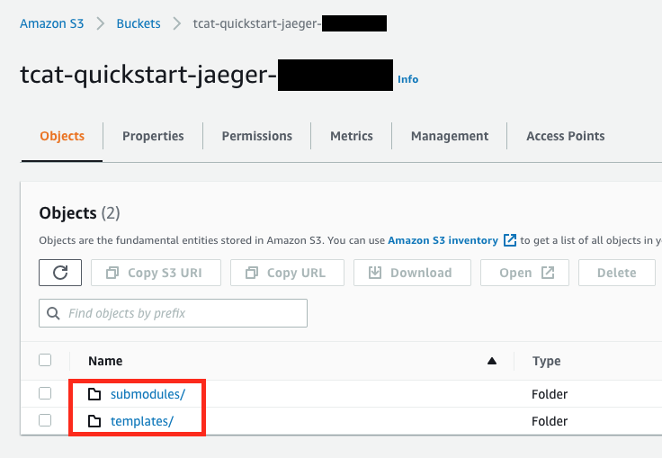
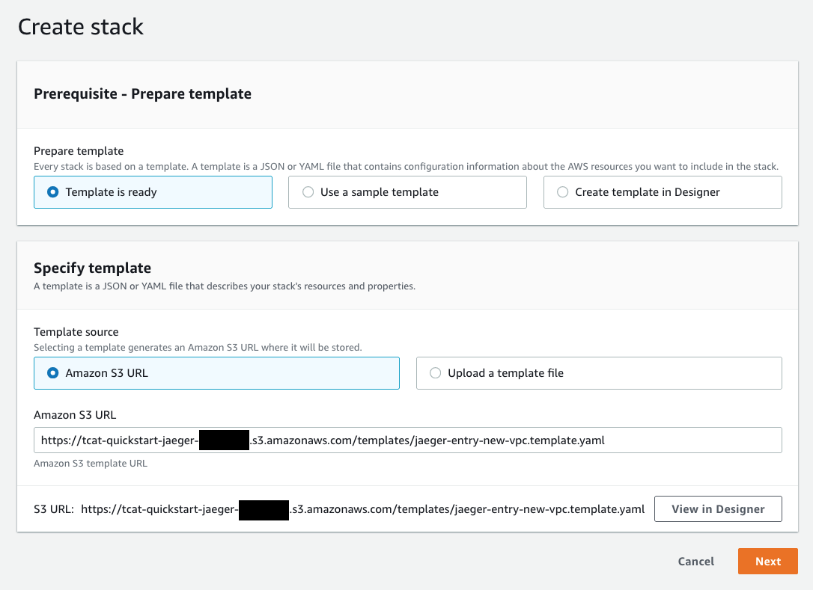
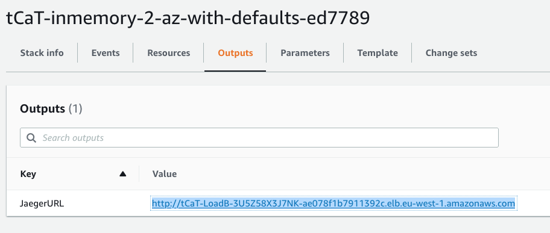

// We need to work around Step numbers here if we are going to potentially exclude the AMI subscription

=== Sign in to your AWS account

. Sign in to your AWS account at https://aws.amazon.com with an IAM user role that has the necessary permissions. For more information, see
 link:#_planning_the_deployment[Planning the deployment], earlier in this guide.
. Ensure that your AWS account is configured correctly, as discussed in the
 link:#_technical_requirements[Technical requirements] section.
. Use the Region selector in the navigation bar to choose the AWS Region where you want to deploy Jaeger.

=== Launch the Quick Start
. Choose one of the available options to launch the AWS CloudFormation template into your AWS account. For help with choosing an option, see link:#_deployment_options[Deployment options], earlier in this guide.

. Download Jaeger Quick Start CloudFormation templates from https://github.com/kolomiets/quickstart-jaeger/releases[Releases page]

. Upload the templates _preserving folder structure_ to S3 bucket in your AWS account
+

. Get object URL for either `jaeger-entry-new-vpc.template.yaml` or `jaeger-entry-existing-vpc.template.yaml` entry template from `templates` folder
+
image::../images/deployment/2-object-url.png[CloudFormation templates object URL]

. Go to [AWS CloudFormation console](https://console.aws.amazon.com/cloudformation/) - select the region you want to deploy the Quick Start to and click `Create Stack` -> `With new resources`

. Use object URL for the entry template as `Amazon S3 URL`, click *Next*
+

. On the *Specify stack details* page, change the stack name if needed. Review the parameters for the template, and provide values for any parameters that require input. For all other parameters, review the default settings, and customize them as necessary. Make sure that **AWS Quick Start configuration** parameters correctly reflect information about your S3 bucket. Click *Next* when ready
+
image::../images/deployment/4-bucket-parameters.png[Quick Start bucket parameters]

. On the *Configure stack options* page, you can https://docs.aws.amazon.com/AWSCloudFormation/latest/UserGuide/aws-properties-resource-tags.html[specify tags^] (key-value pairs) for resources in your stack and https://docs.aws.amazon.com/AWSCloudFormation/latest/UserGuide/cfn-console-add-tags.html[set advanced options^]. When you’re done, choose *Next*.

. On the *Review* page, review and confirm the template settings. Under *Capabilities*, select the two check boxes to acknowledge that the template creates IAM resources and might require the ability to automatically expand macros.

. Choose *Create stack* to deploy the stack.
ifndef::partner-product-short-name[. Monitor the status of the stack. When the status is *CREATE_COMPLETE*, the {partner-product-name} deployment is ready.]
ifdef::partner-product-short-name[. Monitor the status of the stack. When the status is *CREATE_COMPLETE*, the {partner-product-short-name} deployment is ready.]

. Use the values displayed in the *Outputs* tab for the stack, as shown in <<cfn_outputs>>, to view the created resources. Click *JaegerURL* output value to open Jaeger web interface.

:xrefstyle: short
[#cfn_outputs]
ifndef::partner-product-short-name[.{partner-product-name} outputs after successful deployment]
ifdef::partner-product-short-name[.{partner-product-short-name} outputs after successful deployment]

// [DK] Commented out until we have an official S3 bucket for the Quick Start deployment.
// === Launch the Quick Start

// . Choose one of the following options to launch the AWS CloudFormation template into your AWS account. For help with choosing an option, see link:#_deployment_options[Deployment options], earlier in this guide.
// [cols=",",",]
// |===
// |https://fwd.aws/6dEQ7[Deploy {partner-product-name} into a new VPC^]
// |https://fwd.aws/e37MA[Deploy {partner-product-name} into an existing VPC^]
// |===
// Deployment can take between {deployment_time} to complete, depending on the chosen deployment option and parameter values.

// [start=3]
// . Check the Region that’s displayed in the upper-right corner of the navigation bar, and change it if necessary. This is where the infrastructure for Jaeger is built. The template launches in the US East (Ohio) Region by default.
// . On the *Select template* page, keep the default setting for the template URL, and then choose *Next*.
// . On the *Specify stack details* page, change the stack name if needed. Review the parameters for the template, and provide values for any parameters that require input. For all other parameters, review the default settings, and customize them as necessary.

// NOTE: Unless you are customizing this Quick Start's templates for your own deployment projects, we recommend that you keep the default settings for the parameters labeled `Quick Start S3 bucket name`, `Quick Start S3 bucket
// Region`, and `Quick Start S3 key prefix`. Changing these parameter settings automatically updates code references to point to a new Quick Start location. For more information, see the https://aws-quickstart.github.io/option1.html[AWS Quick Start Contributor’s Guide^].

// [start=6]
// . On the *Configure stack options* page, you can https://docs.aws.amazon.com/AWSCloudFormation/latest/UserGuide/aws-properties-resource-tags.html[specify tags^] (key-value pairs) for resources in your stack and https://docs.aws.amazon.com/AWSCloudFormation/latest/UserGuide/cfn-console-add-tags.html[set advanced options^]. When you’re done, choose *Next*.
// . On the *Review* page, review and confirm the template settings. Under *Capabilities*, select the two check boxes to acknowledge that the template creates IAM resources and might require the ability to automatically expand macros.
// . Choose *Create stack* to deploy the stack.
// ifndef::partner-product-short-name[. Monitor the status of the stack. When the status is *CREATE_COMPLETE*, the {partner-product-name} deployment is ready.]
// ifdef::partner-product-short-name[. Monitor the status of the stack. When the status is *CREATE_COMPLETE*, the {partner-product-short-name} deployment is ready.]
// . Use the values displayed in the *Outputs* tab for the stack, as shown in <<cfn_outputs>>, to view the created resources.

// :xrefstyle: short
// [#cfn_outputs]
// ifndef::partner-product-short-name[.{partner-product-name} outputs after successful deployment]
// ifdef::partner-product-short-name[.{partner-product-short-name} outputs after successful deployment]
// image::../images/deployment/5-jaeger-url.png[CloudFormation outputs]